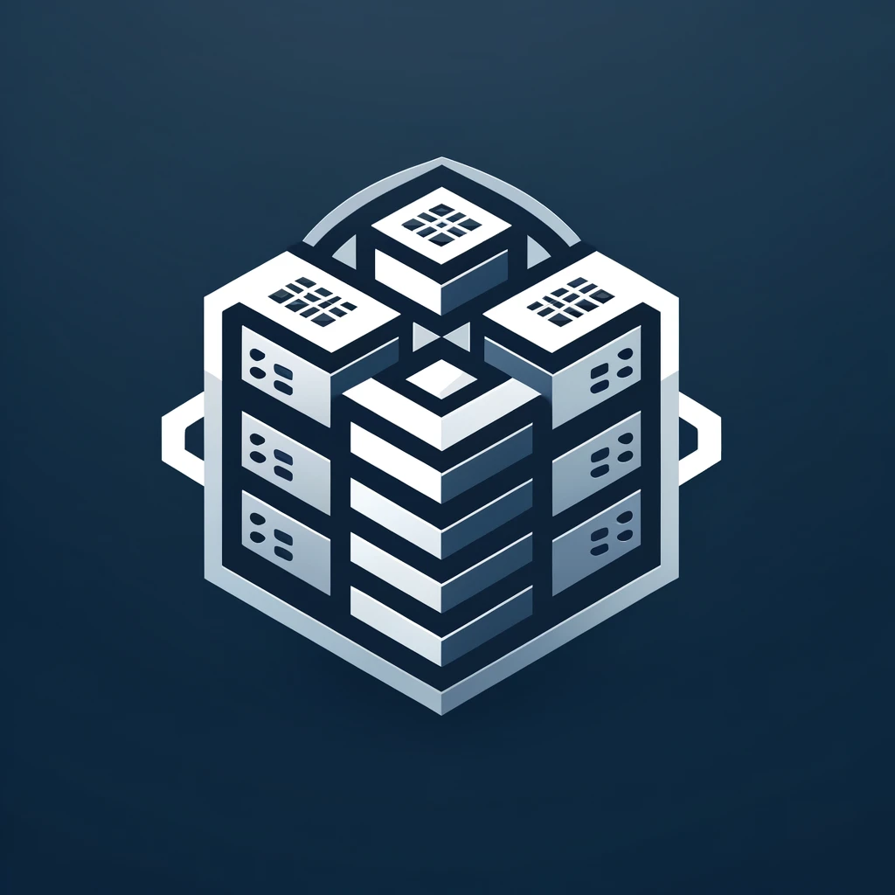
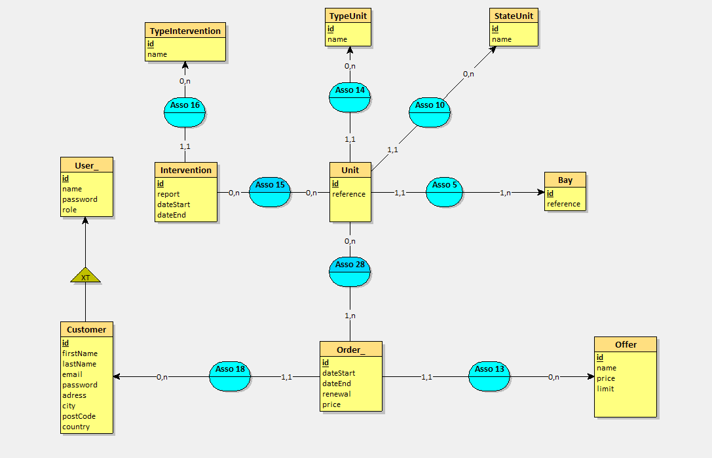

# Projet Work Together

# MCD

# Installation du projet
- composer install 
- yarn install

# Créer la base de données
- php bin/console doctrine:database:create

# Exécuter les migrations
- php bin/console doctrine:migrations:migrate 

# Compiler les assets avec Webpack Encore
- yarn encore dev --watch

# Démarrer le serveur 
- symfony server:start

# Déployer la nouvelle version après chaque push main
- Ouvrir WSL
- cd /mnt/c.. (till project)
- vendor/bin/dep deploy

# TO DO

- Finir et valider la base de donnée (Fixtures, entities)
- Réparer le mailer
