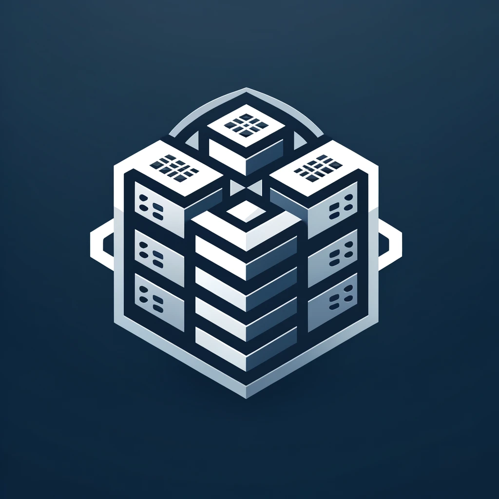
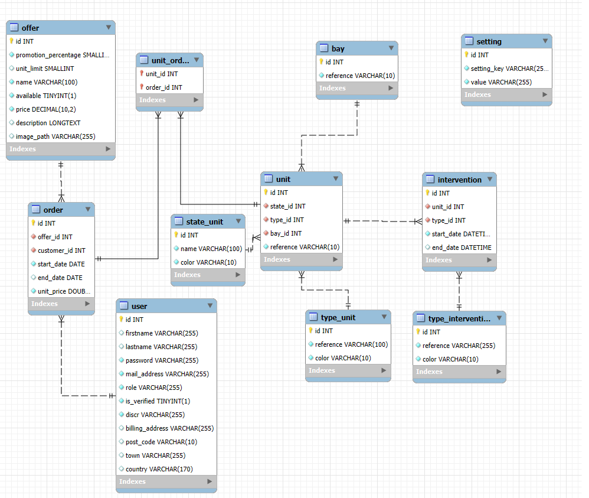

# Projet Work Together

# MCD

# Installation du projet
- composer install 
- yarn install

# Créer la base de données
- php bin/console doctrine:database:create

# Exécuter les migrations
- php bin/console doctrine:migrations:migrate

# Exécuter les datafixtures
- php bin/console doctrine:fixtures:load

# Compiler les assets avec Webpack Encore
- yarn encore dev --watch

# Démarrer le serveur 
- symfony server:start

# Déployer la nouvelle version après chaque push main
- Ouvrir WSL
- cd /mnt/c.. (till project)
- vendor/bin/dep deploy

# Documentation : 
- WIP

# TO DO
- Rôle Technicien
- Suppression des données - Anonymisation
- Champ Numéro de Téléphone

# Évolutions :

- Système de Ticketing
- Pouvoir voir le mot de passe avec un bouton lors de la création / modification du compte
- Email de vérification au changement de mail
- Calcul du temps d'arrêt du service
- Système de Promotion

